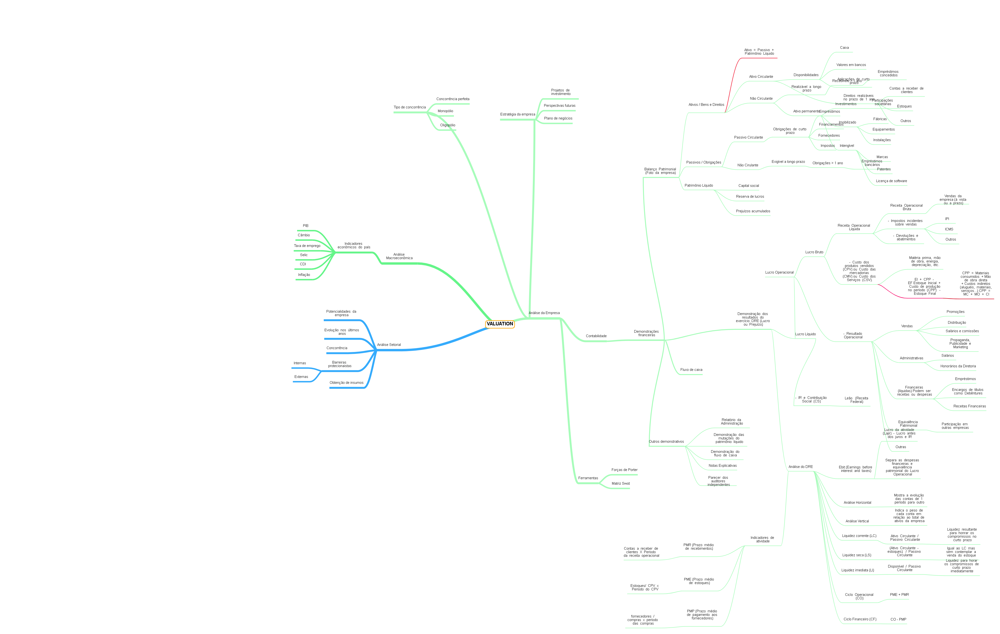

# Nome do projeto

>Resumo curto sobre o que o projeto faz no máximo 2 linhas

1 ou 2 parágrafos sobre o projeto e o que ele faz

Colocar uma imagem da tela do projeto


## Instalação ou outra coisa

Mac OS / Linux
```sh
npm install --save
```

Windows
```sh
edit autoexec.bat
```

##Exemplo de uso 

Alguns exemplos que motivariam as pessoas a utilizarem seu projeto ou que demostrasse que este é útil para alguma coisa. Divida esta parte em partes menores e se possível coloque algum código ou prints de telas. 

##Ambiente de desenvolvimento

Descrever como instalar e preparar qualquer dependência de desenvolvimento para que seu projeto possa ser executado localmente e pessoas possas contribuir como mesmo. 
Se possível forneça as informações para diferentes plataformas, exemplo windows, linux e mac OS. 

##Histórico de atualizações

* 0.2.1
    * CHANGE: Atualização dos docs (o código não foi alterado)
* 0.2.0
    * CHANGE: Removida a função `setPadrãoXYZ()`
    * ADD: Adicionado a função `Inicializar()`
* 0.1.1
    * Fix: Crash quando executava `escrever()`(Obrigado ao @Contribuidor)
* 0.1.0
    * O primeiro lançamento estável
    * CHANGE: Renomeado de `Projeto XYZ` para `Projeto ABC`
* 0.0.1
    * Projeto inicial

## Meta

Seu nome - [@SeuTwitter](https://twitter.com/seutwitter)
email@gmail.com.br
Distribuido sobre a licença. Veja `Licença`para mais informações. 
(http://github.com/seuusuario/seuprojeto)


